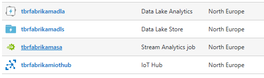
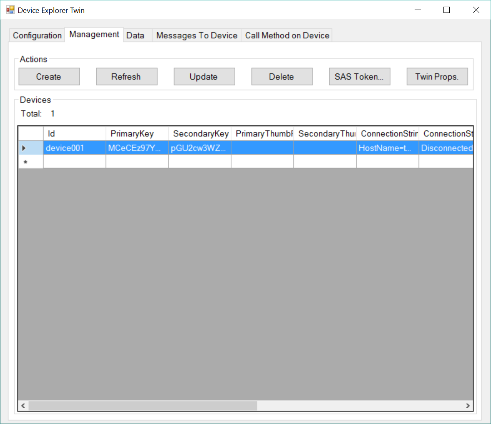
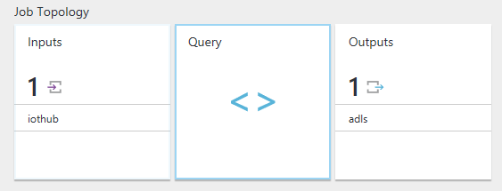
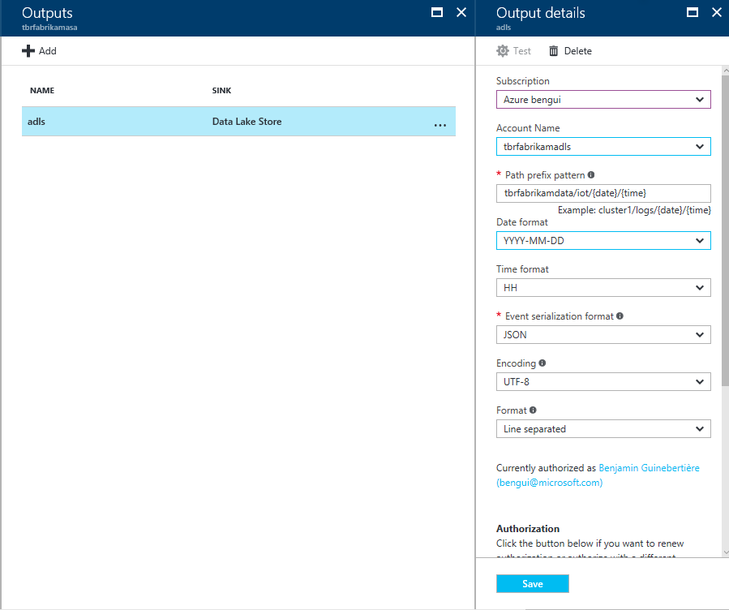

# create artifacts

The script in this folder will create the following: 



i.e.

- An Azure Data Lake Store
- An Azure Data Lake Analytics account
- An Azure Stream Analytics Job
- an Azure IoT Hub

There are still manual operations that need to be done and which are not automated: 
- create at least one IOT device
- configure the Stream Analytics job

## run the script to create artifacts in your environment

you must fill in the parameters in the `createartifacts.sh` script

```bash
declare subscriptionId=""
declare namingPrefix=""
```

alternatively, you can pass those parameters when invoking the script. 

Run the script

## create at least one device in IoT Hub

On Windows 

install 
<https://github.com/Azure/azure-iot-sdks/releases/download/2016-11-17/SetupDeviceExplorer.msi> on Windows

run it from `C:\Program Files (x86)\Microsoft\DeviceExplorer`

Create one device with an Id of `device001`.



## configure the Stream Analytics job

In Stream Analytics, create an input linked to the IoT Hub and an output linked to the Data Lake Store account:


here are properties for the output:

