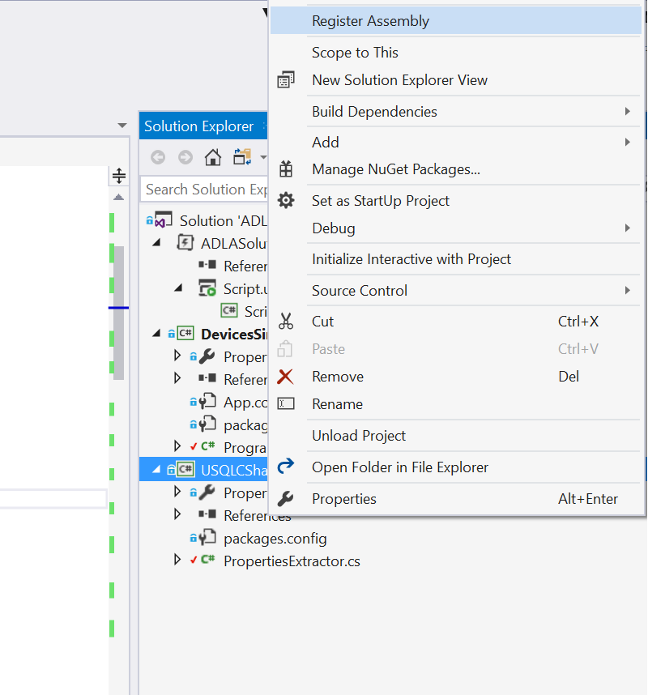

# sample code

This sample code injects data from a simulator to an IOT Hub, stores it in Azure Data Lake Store thru Azure Stream Analytics. From there, it can be analyzed in order to extract data that corresponds to alerts.

## naming conventions

all words starting with `tbr` have To Be Renamed. Choose your own values for those names. 

## how to create the artifacts in your Azure subscription

In order to create the artifacts in your subscription, please follow instructions in the [CreateArtifcats folder](CreateArtifacts/README.md).


## how to run the sample

Once you've created the artifacts, you can open the ADLASolution with Visual Studio 2017. You should have the Azure Data Lake tools installed. 

In the `DevicesSimulator` project you must replace the 2 following lines by your values: 

```csharp
static string iotHubUri = "tbrfabrikamiothub.azure-devices.net";
static string deviceKey = "MCeCEz97##obfuscated##v7v8f0s="; // the corresponding device id is expected to be: device001
```

then you can run this project.

Azure Stream Analytics will get the messages from IoT Hub and copy them to Azure Data Lake Store. 
You should see something like this: 


This date and time can be copied in the U-SQL query: 

```sql
@int1 =
    SELECT wholeLine, datadate, filename,
           filename.Substring(0,2) AS filenameHour,
           USQLCSharpHelper.PropertiesExtractor.ExtractPropertiesFromJson(wholeLine) AS extracted
    FROM @logs
    WHERE datadate == "2017-03-11" AND filename.StartsWith("15"); /* update with your date and time */
```

Select the `USQLCSharpHelper` project and register the assembly in Data Lake Analytics.




then you can submit the U-SQL query 


and you should get the results in the data lake store `/output`folder. You can also find sample content of those files in the `SampleOutput` folder of this repository.

