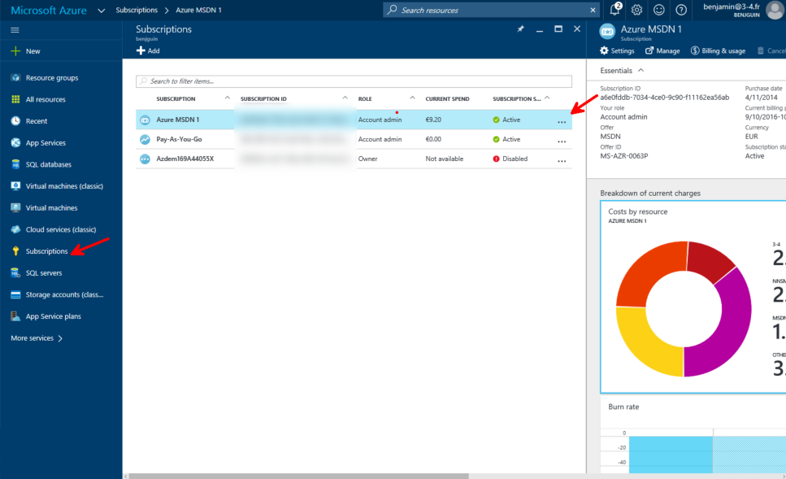
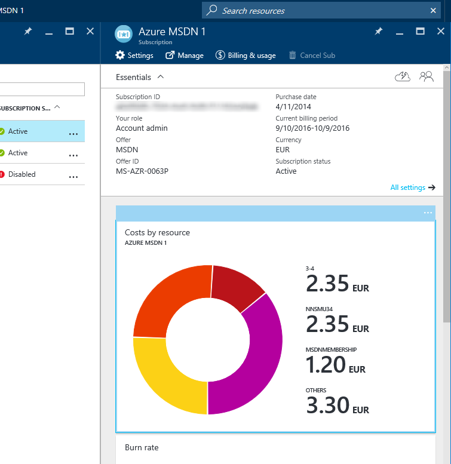
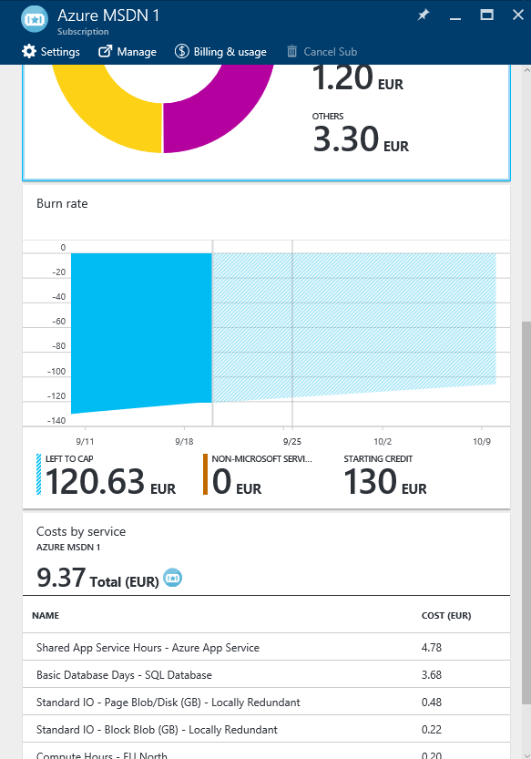

# Azure Consumption

In order to see how much you've spent so far, go the [portal](https://portal.azure.com), and select your subscription:

You should get this kind of information:

If you want more, or use the API, you've got sample code here: <https://github.com/Microsoft/AzureUsageAndBillingPortal>.

You may also want to see the information from https://account.windowsazure.com

