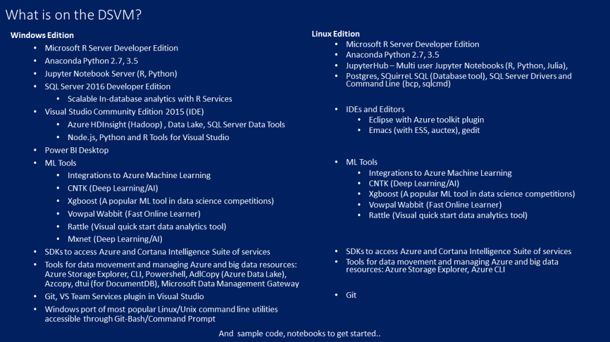
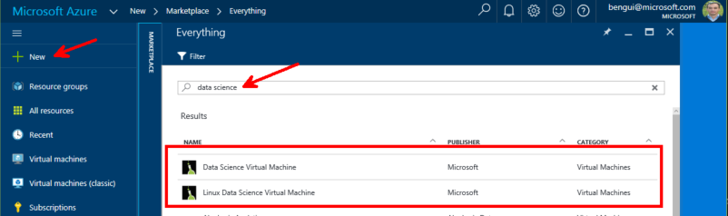

# Linux on Azure

Here is some documentation on how to create and use Linux VMs hosted in Azure.

## Prepare your local environment

Your local environment may be MAC, Windows or Linux

### Portal or the command line 

You can manage most of the things from the [portal](http://portal.azure.com) which works from most HTML 5 browsers.

If you prefer to do everything from the command line, you can download and install the Azure command line interface (Azure CLI) from azure.com, resources, downloads, and search for "Azure command-line interface".

### Prepare your SSH key

If you already have your SSH keys, you may skip this.

On Windows, we'll use a bash command line prompt to generate keys and access to the VMs thru ssh. This documentation as been tested with the one provided by the [git client](http://www.git-scm.com/downloads).
With the latest version of Windows 10, you may also want to use [Bash on Ubuntu on Windows](https://msdn.microsoft.com/en-us/commandline/wsl/about).

We will be using SSH keys to connect to the different VM created in this Workshop. Use the following commands to create SSH keys:

(replace john and 3-4.fr by your own values)

```
ssh-keygen -t rsa -C "john@3-4.fr"
```

Enter **`john`** for the file name and do not set any passphrase. This will create 2 files:

* `john` : identification/private key
* `john.pub` : public key

Create a Certificate that will be used to create new VMs from the Azure CLI (Command Line Interface):

On MAC or Linux:
```
openssl req -x509 -days 365 -new -key john -out john.pem
```

On Windows:
```
openssl req -config /usr/ssl/openssl.cnf -x509 -days 365 -new -key john -out john.pem
```

Entered the following (exemple):
```
Country Name (2 letter code) [AU]:FR
State or Province Name (full name) [Some-State]:France
Locality Name (eg, city) []:Paris
Organization Name (eg, company) [Internet Widgits Pty Ltd]:john
Organizational Unit Name (eg, section) []:john
Common Name (eg, YOUR name) []:john
Email Address []:john@3-4.fr
```

You shoud now have the following files: 

- a private key file: john
- a public key file: john.pub
- a certificate file: john.pem

## Create a Linux VM and connect to it

This is explained at <https://azure.microsoft.com/en-us/documentation/articles/virtual-machines-linux-quick-create-portal/>

You may also want to use the [Microsoft Data Science Virtual Machine](https://blogs.technet.microsoft.com/machinelearning/2016/09/13/recent-updates-to-the-microsoft-data-science-virtual-machine/).




You can create your instance from <https://portal.azure.com>



## Create an SSH tunnel

In some cases, you may need to open an SSH tunnel so that your laptop can access the same resources as the Linux VM you are connected to.
One of the use cases is a [Linux HDInsight cluster](HDInsight.md).

From a bash (or git client on Windows) command line prompt, you can issue a command like
```
ssh -D5034 -N -i 1509b benjguin@acs34bmgmt.westheurope.cloudapp.azure.com -p 2200
```

### use the ssh tunnel from a browser

Afterwards, you configure your browser to use the SSH session with dynamic tunneling as a SOCKS proxy. 
This example is with Firefox: 


Connect to the HDInsight head node, and follow links as if you were browsing from the headnode:


### use Jupyter

On the data science VM, Jupyter is available at `https://{IPAddress}:8000/`
