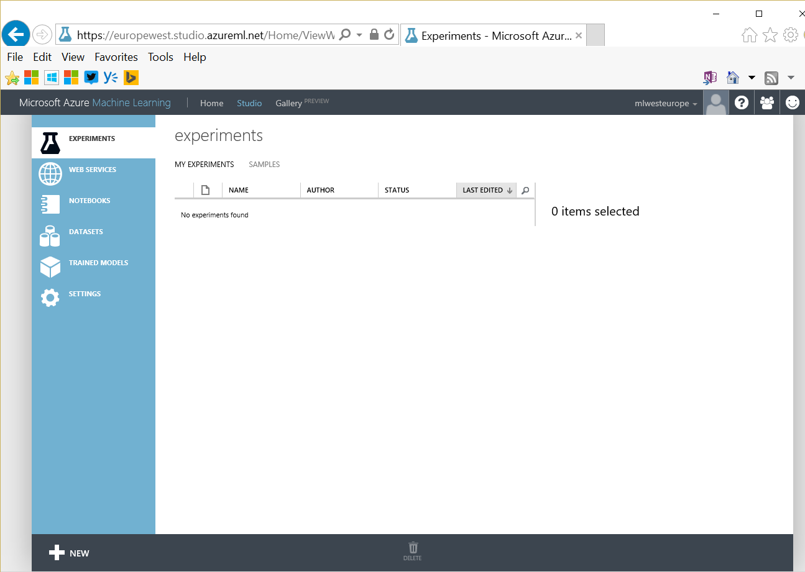

# Azure Machine Learning (Azure ML)


The main page where you can get documentation is at <http://azure.com/ml>. 

The studio is available at <https://studio.azureml.net>.

You may also want to visit the gallery where you'll get a lot of samples: <https://gallery.cortanaintelligence.com/>.

If you need out of the box APIs, please see [Cognitive Services](CognitiveServices.md).

## create your workspace

If you need more control and want to develop your own machine learning experiment you can use Azure ML Studio. 
While there is a free offer, as you get an Azure PASS, you might prefer to create an Azure ML environment from you Azure subscription first. If you do that, you'll get additional options like storing more data, having different endpoints (production, development, ...).

For that, go to [https://manage.windowsazure.com](https://manage.windowsazure.com), MACHINE LEARNING, and create a new workspace. 


prefer "West Europe" as location.


Then you can go to the [Azure ML studio](http://studio.azureml.net).




## how to use a pipe (|) separated file in Azure ML

Here is a sample file

```
af|b|12.345|d
a|bfd|13.345|e
aff|bfd|14.345|f
ar|bds|12|ddsj
```

Import it in Azure ML: 

New Dataset

select the following options: 


NB: It is important to upload the file as a TSV or TSV with no header dataset so that we can use it as a 1 column dataset inside Azure ML.

Then create an experiment where you start by your dataset, then add a Python Script 


Choose Python 3, and replace the script by the following.

NB: in your case, you may have different `columns`. Please change the script accordingly.

```
# The script MUST contain a function named azureml_main
# which is the entry point for this module.

# imports up here can be used to 
import pandas as pd

# The entry point function can contain up to two input arguments:
#   Param<dataframe1>: a pandas.DataFrame
#   Param<dataframe2>: a pandas.DataFrame
def azureml_main(dataframe1 = None, dataframe2 = None):
    df = pd.DataFrame(dataframe1[dataframe1.columns[0]].apply(lambda r: r.split("|")).tolist(),
            columns = ['mycol1','mycol2','mynumber','mylastcol'])

    return df,
```


Then, you want to have the numerical column to be understood as numeric. 
For that, you may want to use the `edit metadata` module in Azure ML.


