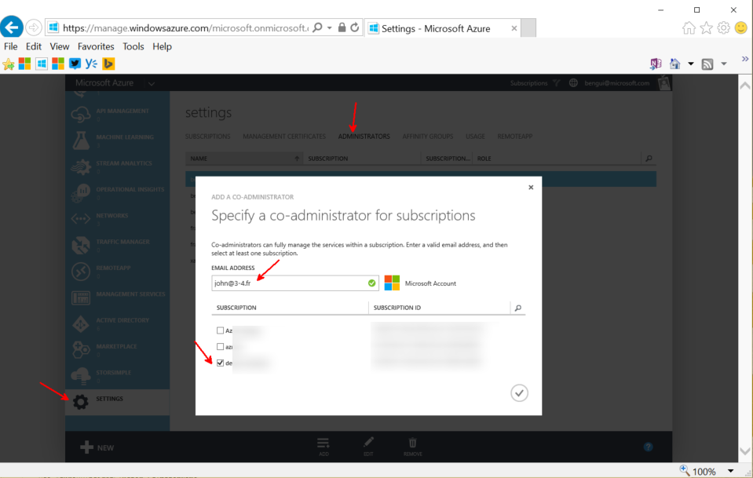

# Azure PASS

PREFERRED WAY: 

You may want to [create an organization account together with your new Azure PASS](AzurePASSorg.md)

If you prefer to use a Microsoft account (~personal account),
The generic documentation to redeem your Azure PASS is at [https://www.microsoftazurepass.com/howto](https://www.microsoftazurepass.com/howto).

A few hints: 
- you can create a Microsoft Account from https://account.microsoft.com
- while creating from https://microsoftazurepass.com, if the page takes time to load, please wait. 
- After the subscription creation, you can see it at https://portal.azure.com
- want to see the $100 / €85, see [the AzureConsumption page](AzureConsumption.md)

For this Hackathon, here are additional details: 

- the country must be: France
- you can only redeem one PASS per Microsoft account. 
- You may want to share your subscription with your teammates. To do that, you can add co-admins by going to [https://manage.windowsazure.com](https://manage.windowsazure.com), Settings (at the bottom left of the screen), and add administrators:

If you need to to know how much you've spent so far, see [AzureConsumption](AzureConsumption.md)
