# how to create an Azure PASS and an organizational account at the same time

Open a new In Private or Incognito browser Windows and go to <https://www.microsoftazurepass.com>

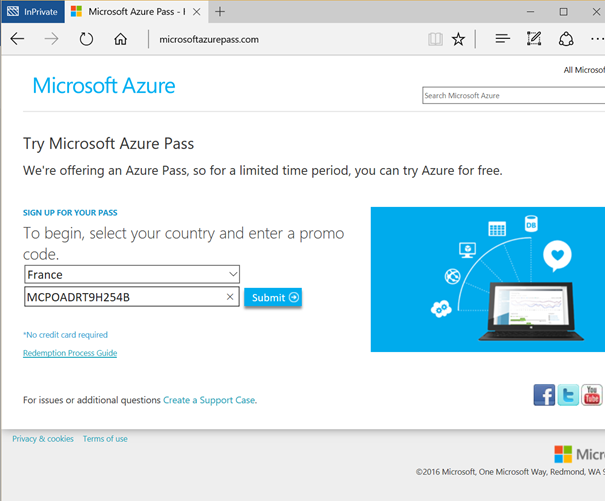

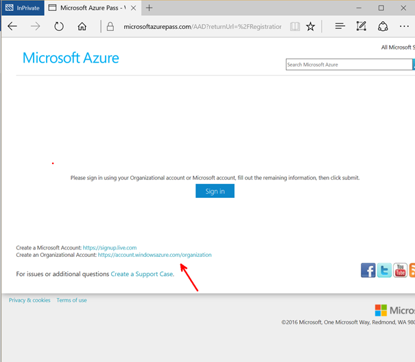

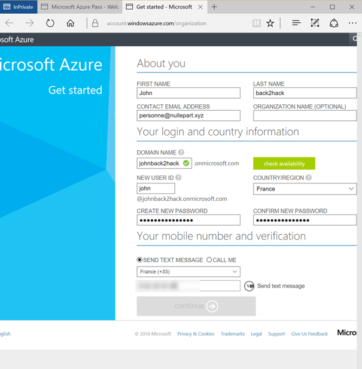

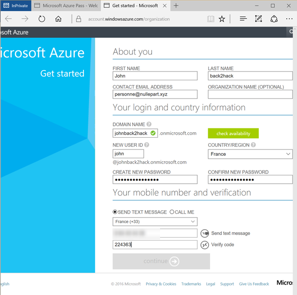

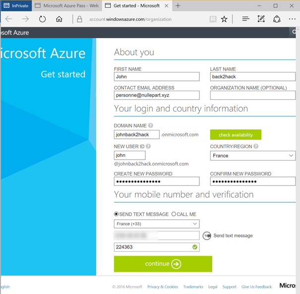

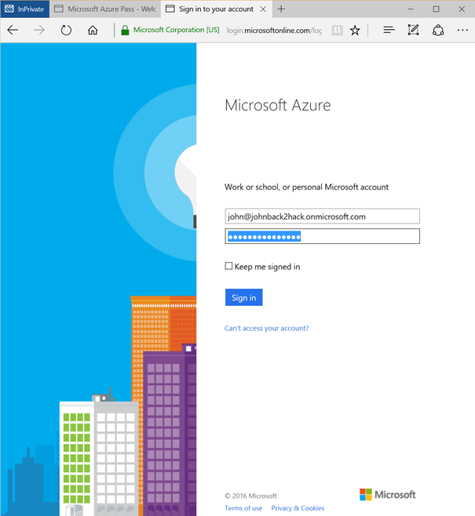

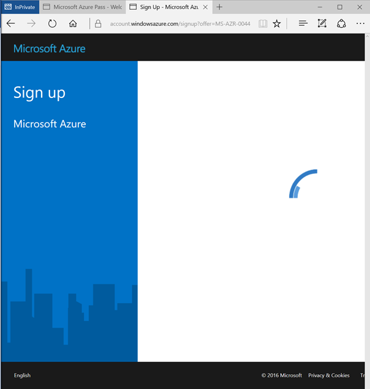

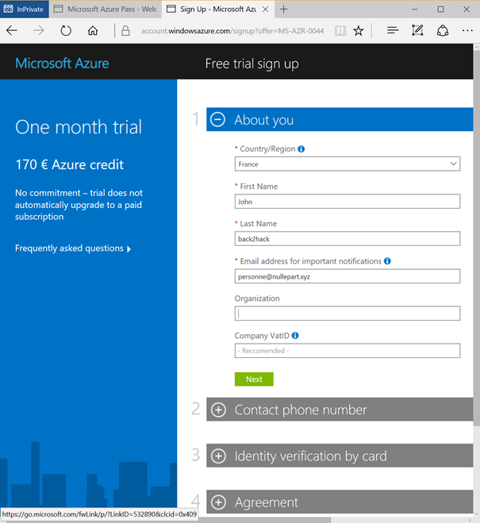

Close the tab on the right (it would lead you to free trial that asks for a Credit Card), 
and use the first tab to continue on with your newly created organizational account.

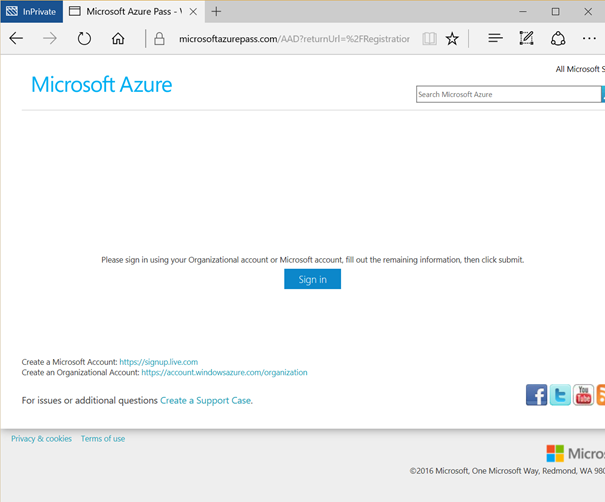

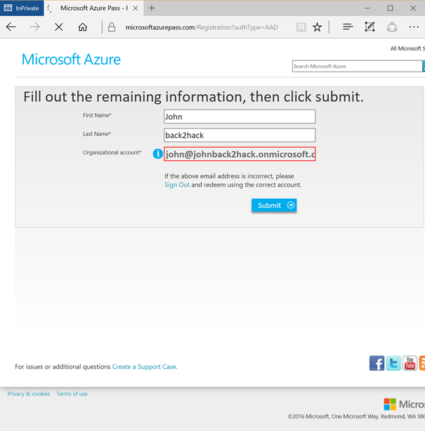

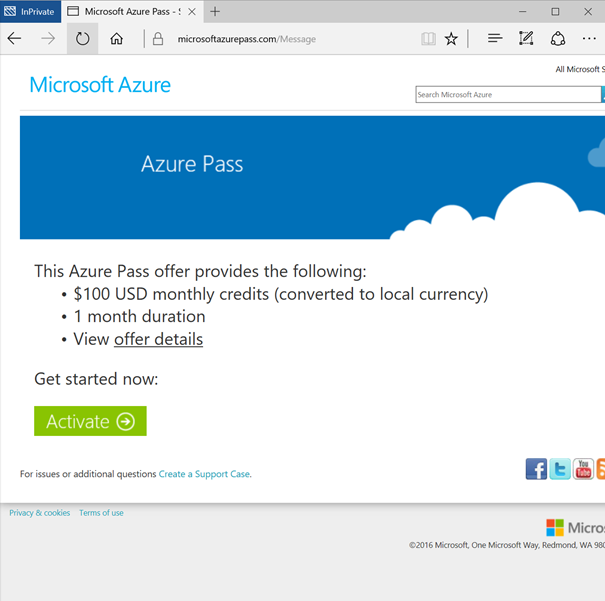

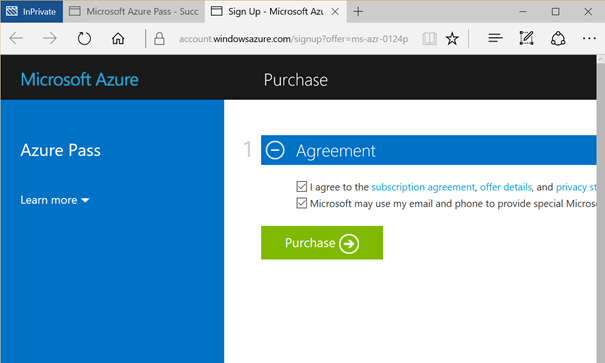

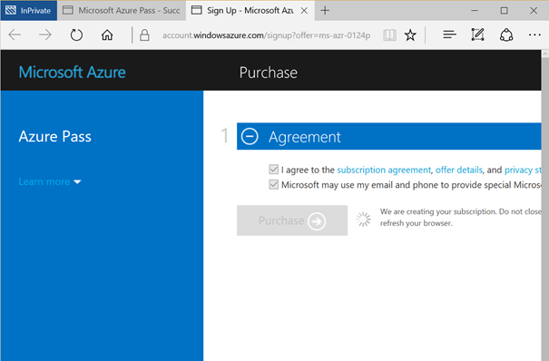

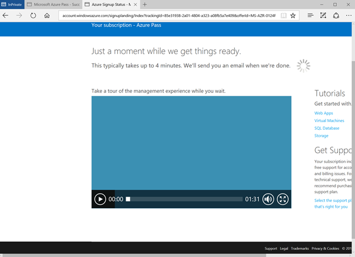

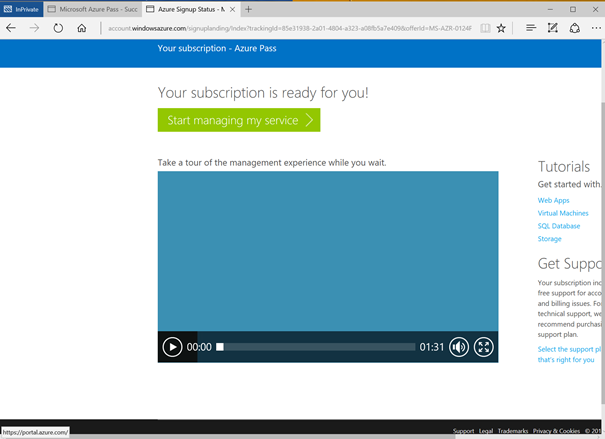

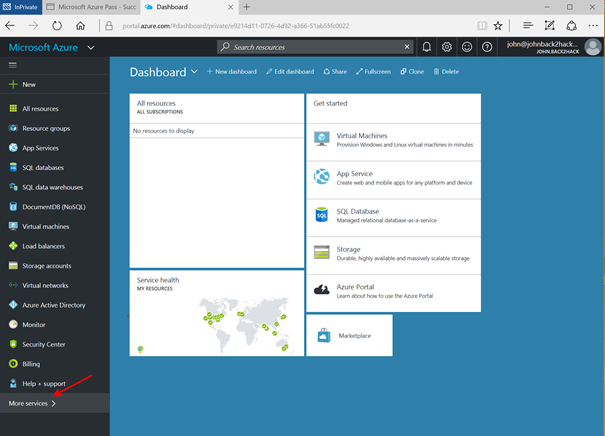

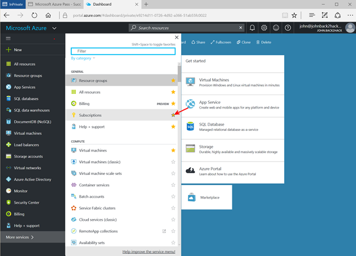

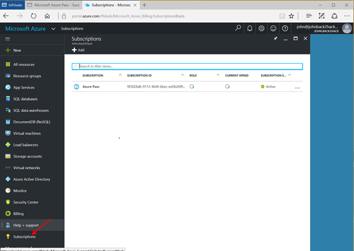

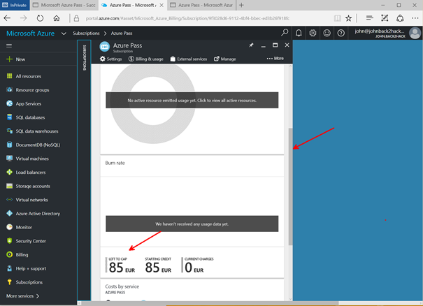

