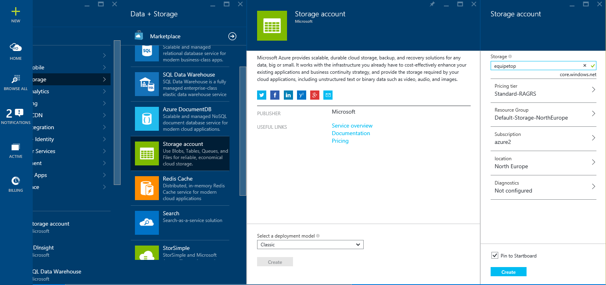
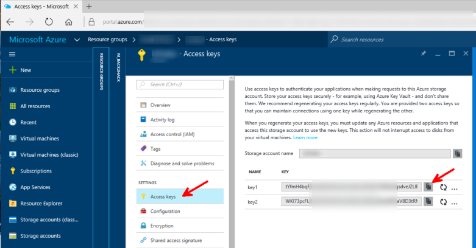

# Create a storage account

A storage account can be used as a source and destination for many Azure services around Big Data and Machine Learning. 

Here is how to create an Azure storage account. 

## create the storage account

Go to [http://portal.azure.com](http://portal.azure.com)

New, Data + Storage, Storage Account

NB: keep "Classic" in the "Select a deployment model"

Enter the following information with the following values (replace values in *italic* by your own values, some of them like the cluster name must be globally unique). The example values used at creation are reused in this documentation so that you can correlate the fields.

- Name: *equipetop*
- Deployment model: Resource manager
- Account Kind: Blob Storage
- Performance: Standard
- Replication: Locally Redundant (Standard-LRS)
- Access Tier: Hot
- Subscription: *(leave default or choose the subscription)*
- Resource Group: Create New, *equipetoprg*
- Location: West Europe

## copy the storage access key

Retrieve the storage key. You can use the primary access key or the secondary access key. 

## use tools

Then, you can use [Azure blob storage tools](Tools.md) (see *Azure blob Storage tools* in the page) to copy data into or from the storage account.

