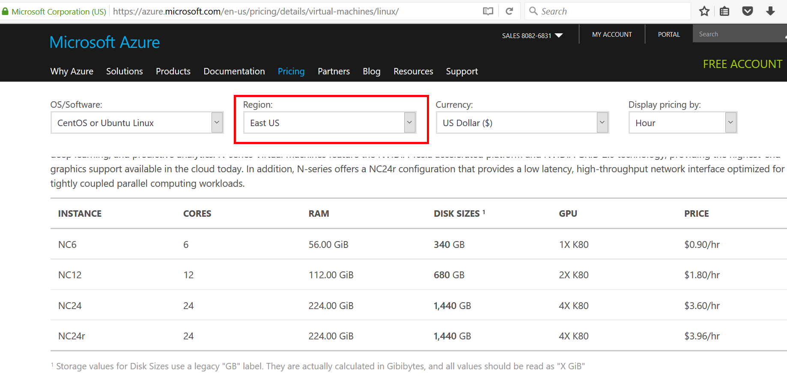

# Azure VM with GPU

You may want to use GPU.

NC (Nvidia Compute) VMs are available with K80 GPU. 

Useful links: 
- <https://docs.microsoft.com/en-us/azure/virtual-machines/virtual-machines-linux-n-series-driver-setup>
- <https://docs.microsoft.com/en-us/azure/virtual-machines/virtual-machines-windows-n-series-driver-setup>
- <https://azure.microsoft.com/en-us/pricing/details/virtual-machines/linux/>

The GPU may be used in conjunction with the Data Science VMs: [Linux](AzureLinux.md) and [Windows](AzureWindows.md)
