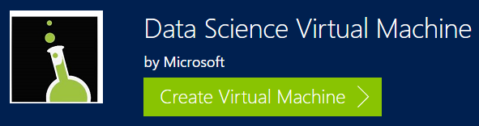
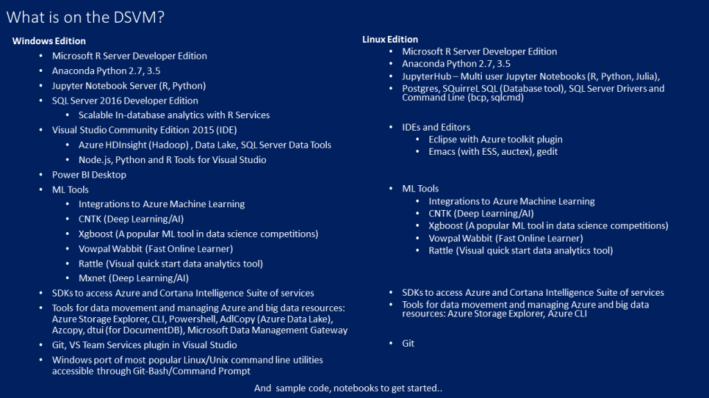
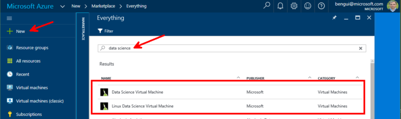

# Windows on Azure

You'll find a full tutorial at [https://azure.microsoft.com/en-us/documentation/articles/virtual-machines-windows-tutorial/](https://azure.microsoft.com/en-us/documentation/articles/virtual-machines-windows-tutorial/).

It shows how to create a VM, and how to connect to it thru Remote Desktop Protocol (RDP).

You may also want to use the [Microsoft Data Science Virtual Machine](https://blogs.technet.microsoft.com/machinelearning/2016/09/13/recent-updates-to-the-microsoft-data-science-virtual-machine/)

You can create your instance from <https://portal.azure.com>

