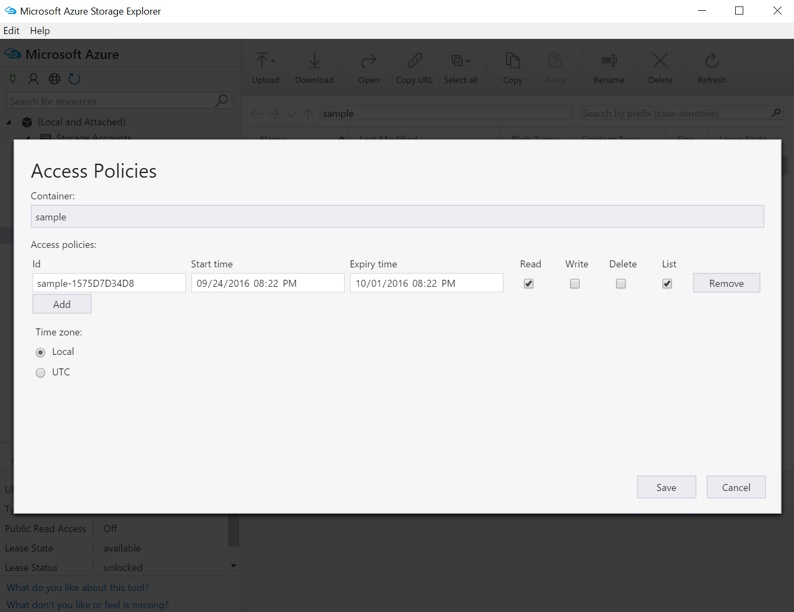
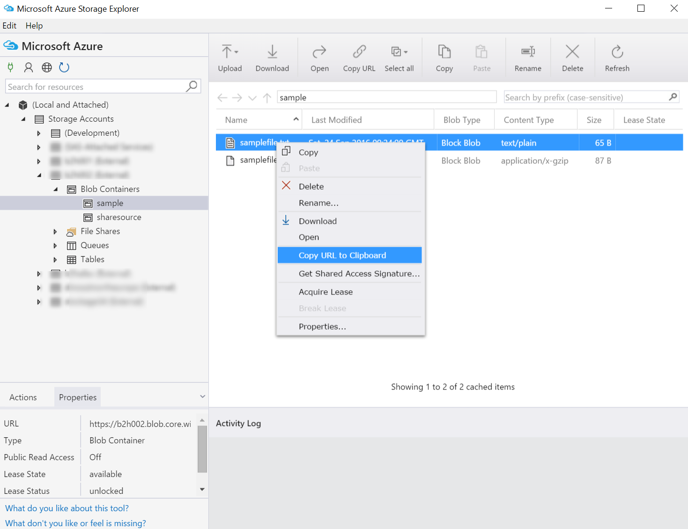

# how to use Azure storage in Jupyter

upload data from the laptop to [Azure Blob storage](AzureStorage.md)

From the [portal](https://portal.azure.com), go to storage account, blobs, and create a container.

from local laptop with Python installed, upload with [blobxfer](https://github.com/Azure/blobxfer)

```
sudo su
pip install blobxfer
exit
export BLOBXFER_STORAGEACCOUNTKEY='thestorageaccountkey'
blobxfer mystorageaccount mycontainer '/my/local/folder/with/data' --upload --include '**/*' 
```

download and install [Azure Storage Explorer](http://storageexplorer.com/)

Give it the storage account key and the storage account name

go to the container where the data was uploaded and right click, choose `manage access policies`

Add a policy with read and list for a few days:



right clic again on the container, and choose `get shared access signature`

select the access policy

`Create`

copy the Query String. It looks like: 

```
?sv=2015-12-11&si=sample-1575D7D34D8&sr=c&sig=AiJyBR5Yq%2FXQpT0gvJLEzgjkQeIf5lRGIv0A6ZDSFWU%3D
```

Then go to any file, right click and select `Copy url to clipboard`  



you get for instance: 

```
https://b2h002.blob.core.windows.net/sample/samplefile.txt
```

concatenate the two and you can HTTP GET any such file in the container.

example: 

```
$ curl "https://b2h002.blob.core.windows.net/sample/samplefile.txt?sv=2015-12-11&si=sample-1
575D7D34D8&sr=c&sig=AiJyBR5Yq%2FXQpT0gvJLEzgjkQeIf5lRGIv0A6ZDSFWU%3D"
af|b|12.345|d
a|bfd|13.345|e
aff|bfd|14.345|f
ar|bds|12|ddsj
```
