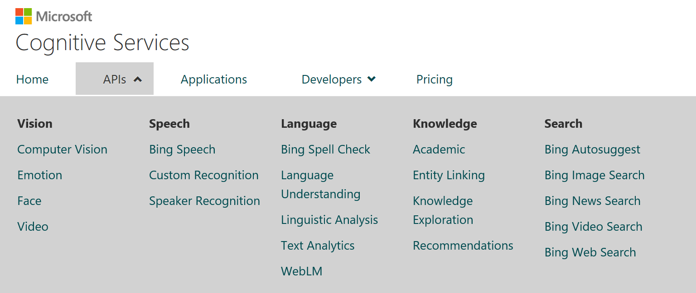
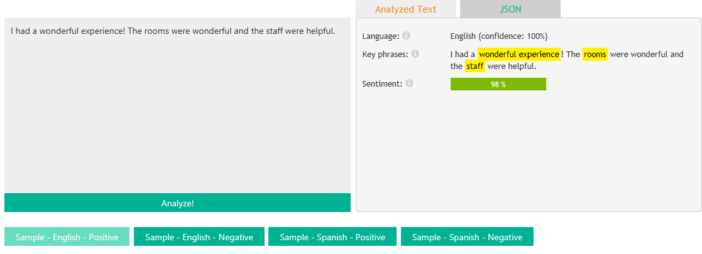
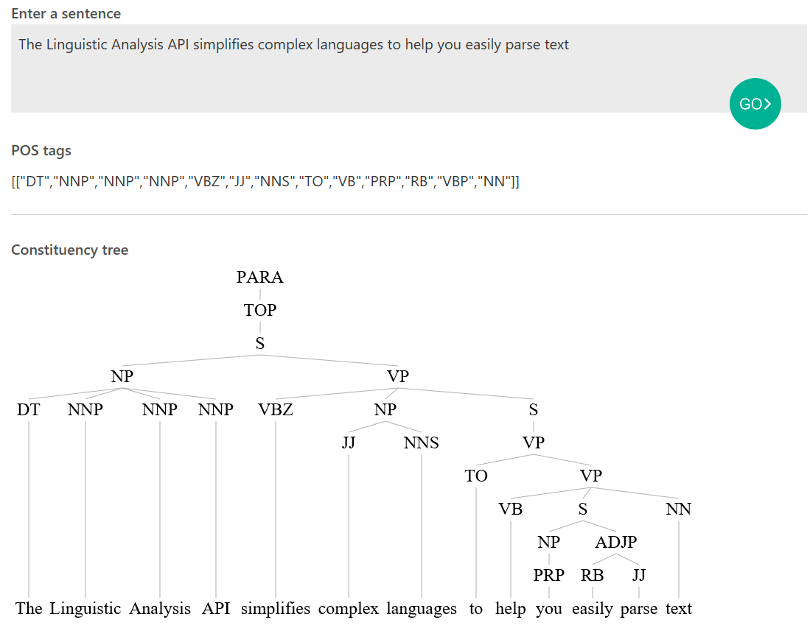
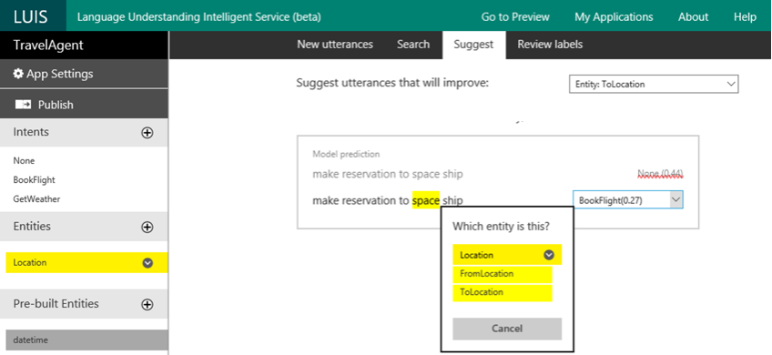
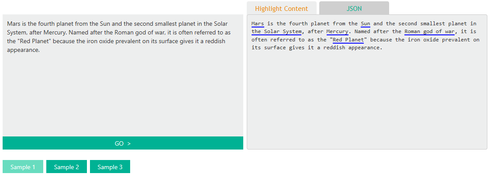
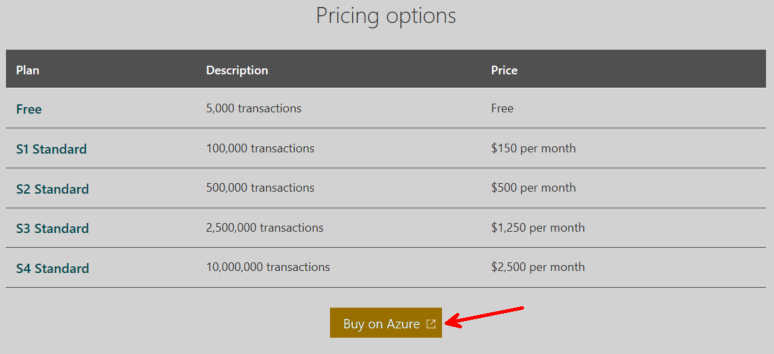
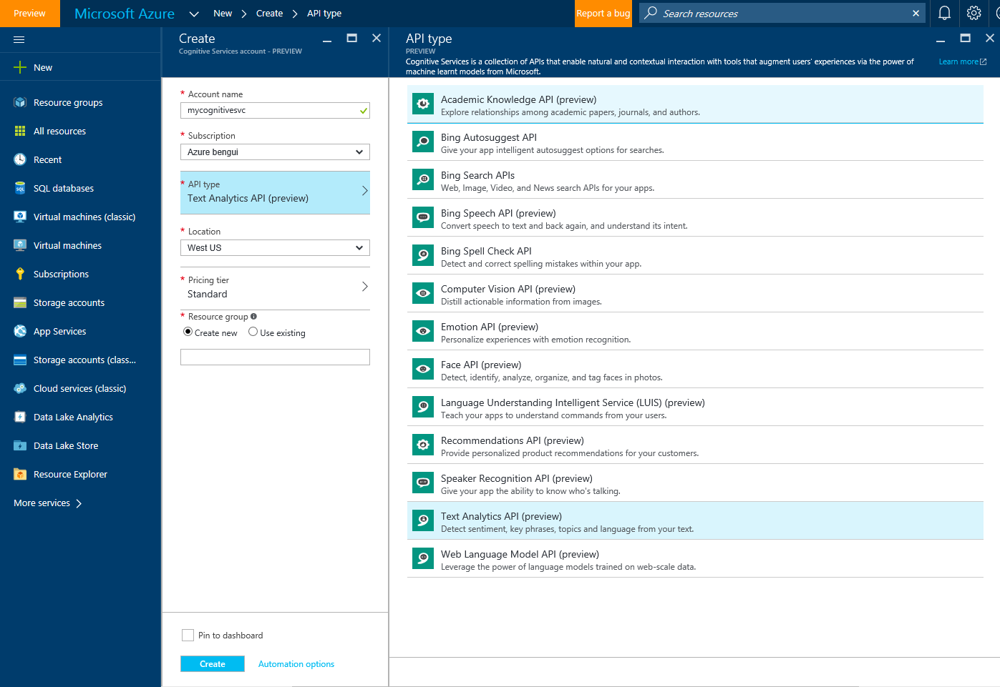
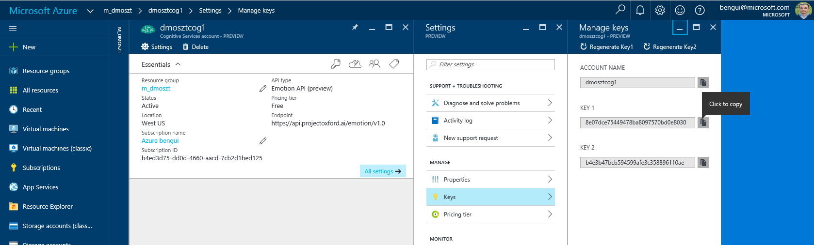

# Cognitive Services

Cognitive services are APIs that are built by Microsoft teams using deep learning and other techniques. 
You can start here: <https://www.microsoft.com/cognitive-services>

Here is an overview of those APIs: 

Here is a list of APIs you may want to see in more details for the Hackathon: 

[*Text Analytics API*](https://www.microsoft.com/cognitive-services/en-us/text-analytics-api): 

Detect sentiment, key phrases, topics, and language from your text.

 

[*Linguistic Analysis API*](https://www.microsoft.com/cognitive-services/en-us/linguistic-analysis-api):

Simplify complex language concepts and parse text with the Linguistic Analysis API.

[*Language Understanding Intelligent Service (LUIS)*](https://www.microsoft.com/cognitive-services/en-us/language-understanding-intelligent-service-luis):

Understand language contextually, so your app communicates with people in the way they speak.

[*Entity Linking Intelligence Service*](https://www.microsoft.com/cognitive-services/en-us/entity-linking-intelligence-service):

Power your app's data links with named entity recognition and disambiguation

 

You can start for free, or buy on Azure as in this example: 

 

This provides you with API keys:

 