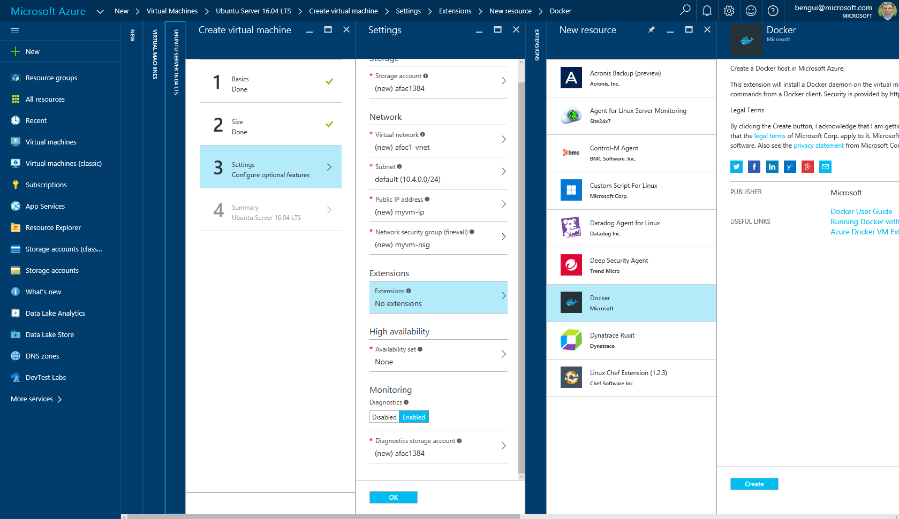

# Leverage Docker

[Docker](http://docker.com) is a good way to develop on one machine, then execute on several ones as shown in this blog post: 
[Deploying Containers to One or Several VMs](http://blog.3-4.fr/2016/08/30/deploying_containers_to_one_or_several_VMs/).

The easiest way to create a docker host VM is to create a new VM (say Ubuntu) and add the docker extension to it.

One way to create a Docker Swarm cluster on Azure is described here: <https://blogs.msdn.microsoft.com/jcorioland/2016/04/28/getting-started-with-containers-and-docker-on-windows-server-2016-technical-preview-5/>.

You can find an example of stream processing engines running on one VM with Docker in this repo: <https://github.com/boontadata/boontadata-streams>.
