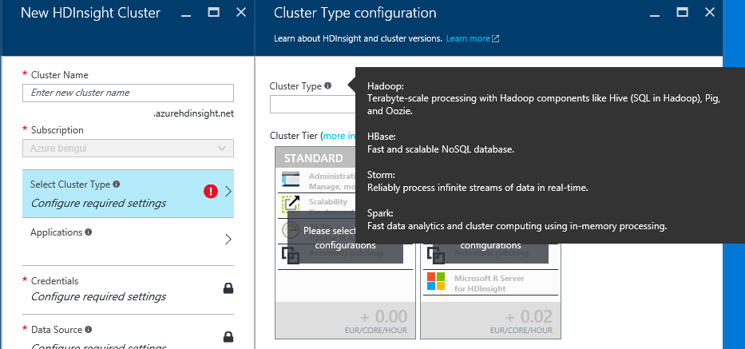

# HDInsight - How can I run Hadoop/Spark/R Server as a service?

Documentation is at <https://azure.microsoft.com/en-us/documentation/services/hdinsight/>.

HDInsight is a PaaS offering for the following types of clusters: 

Optionally, Linux Spark cluster can also have R Server installed, if you want to leverage the statistics language on the cluster. 

In the documentation, this learning map will give you links to the pages you need: <https://azure.microsoft.com/en-us/documentation/learning-paths/hdinsight-self-guided-hadoop-training/>.

You may find sample scripts in the scripts folder of this repo. 

NB: Creating an HDInsight cluster can take 15 to 20 minutes.
If you prefer a serverless query service, you may want to consider [Azure Data Lake Analytics service](AzureDataLake).
While HDInsight is a managed open source cluster, Azure Data Lake Analytics uses a Microsoft only language (for now). 

