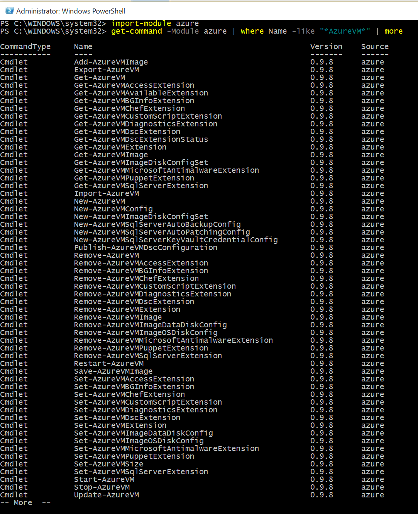
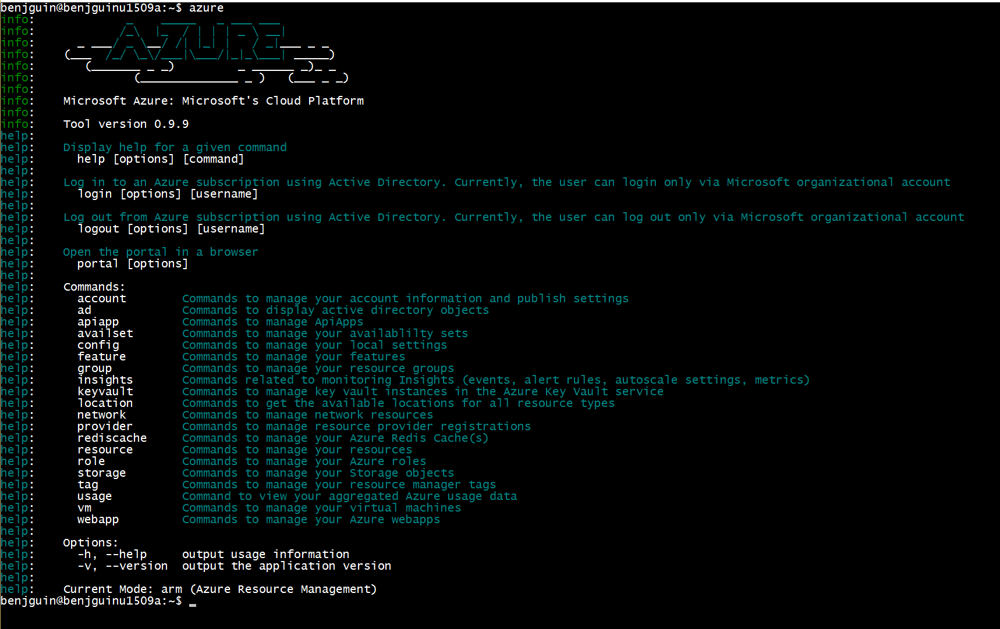
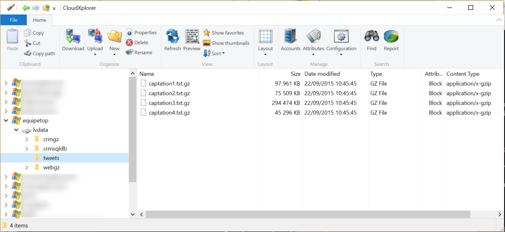
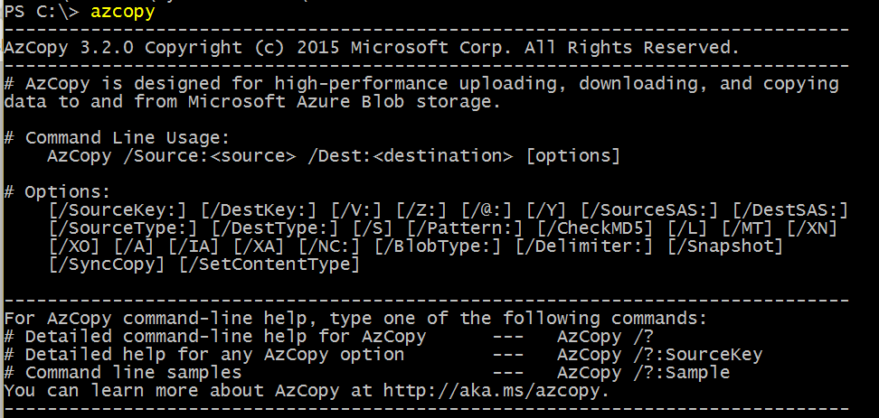

# Tools to access Azure

## portals

There are 2 portals: 

- [https://portal.azure.com](https://portal.azure.com) is the main portal. It is preferred for most services.  
- [https://manage.windowsazure.com](https://manage.windowsazure.com) is the legacy portal. Some services like Azure Active Directory are available only thru this portal.

## Command line tools

Azure can be used from 2 command line tools. They can be downloaded from [http://azure.com](http://azure.com), resources, downloads. 
You may also want to use [docker as a way to have Azure CLI available](https://hub.docker.com/r/microsoft/azure-cli/).  

- PowerShell module is available from a Windows OS (NB: Azure automation is a PowerShell as a service environment).

- Azure Command Line Interface (Azure CLI) is a cross platform tool written as a Node.js npm module. It can run from Mac, Windows and Linux.
 

## Azure blob Storage tools

In order to interact with Azure blob storage, you may want to use the portal or other tools. 

There are graphical tools. Here are two lists of such tools : 
- <https://azure.microsoft.com/en-us/documentation/articles/storage-explorers/>
- <http://storagetools.azurewebsites.net/>

Here is an example: 

There are also command line tools. 
- On Windows : <https://azure.microsoft.com/en-us/documentation/articles/storage-use-azcopy/> 
- On any OS : <https://github.com/Azure/blobxfer>

Here is an example: 

